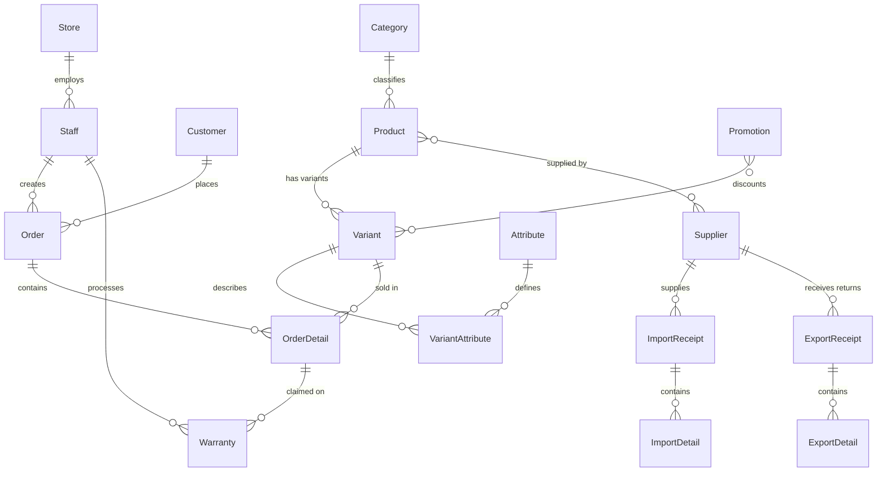

<div align="center">

# 🛒 Retail POS — Point of Sale Management System

**A full-stack retail management platform for electronics & appliance stores**

[](https://nodejs.org/)
[](https://react.dev/)
[](https://www.mysql.com/)
[](https://expressjs.com/)
[](#license)

[Features](#-features) · [Tech Stack](#-tech-stack) · [Getting Started](#-getting-started) · [Architecture](#-architecture) · [API Reference](#-api-reference) · [Database](#-database-schema) · [Contributing](#-contributing)

</div>

---

## 📋 Overview

**Retail POS** is an end-to-end Point of Sale and Store Management web application designed for Vietnamese electronics & appliance retail stores. It covers the full retail lifecycle — from product catalog and warehouse logistics to sales transactions, customer loyalty, warranty processing, and business analytics.

### Why Retail POS?

- 🖥️ **Real-time POS Terminal** — Fast, multi-order sales interface with barcode/SKU lookup
- 📦 **Inventory Control** — Import/export receipts with automatic stock tracking
- 👥 **Customer Loyalty** — Points-based reward system with auto-earn and redemption
- 🔐 **Role-Based Access** — Granular permissions across Owner, Admin, Manager, Staff, and Cashier roles
- 📊 **Business Intelligence** — Revenue reports, inventory alerts, and supplier debt tracking
- 🇻🇳 **Vietnamese-First** — Fully localized UI with Vietnamese-optimized typography

---

## ✨ Features

### Core Modules

| Module | Description |
|---|---|
| **POS Sales** | Multi-order tabs, product grid with category filters, customer search, cash/transfer payments, loyalty points, receipt printing |
| **Order Management** | Order history with search & date filtering, order detail view, status tracking (Draft → Completed → Warranty) |
| **Product Catalog** | CRUD products with categories, dynamic variant attributes (Color, RAM, Storage, etc.), image management |
| **Inventory** | Import receipts from suppliers, export/return receipts, batch & expiry tracking, low-stock alerts |
| **Warranty & Returns** | Warranty period validation, replacement or refund resolution, automatic stock adjustment, full audit trail |
| **Customer CRM** | Customer profiles, phone/email lookup, loyalty points balance, purchase history |
| **Supplier Management** | Supplier profiles with tax codes, import history, debt tracking per supplier |
| **Staff & Permissions** | User accounts with role assignment, password management, role-filtered UI menus |
| **Reports & Analytics** | Daily revenue breakdown, inventory stock reports, supplier debt summary, dashboard KPIs |

### Access Control Matrix

| Feature | Owner | Admin | Manager | Staff / Cashier |
|:---|:---:|:---:|:---:|:---:|
| Dashboard | ✅ | ✅ | ✅ | ✅ |
| POS Sales | ✅ | ✅ | ✅ | ✅ |
| Orders | ✅ | ✅ | ✅ | ✅ |
| Customers | ✅ | ✅ | ✅ | ✅ |
| Products | ✅ | ✅ | ✅ | ❌ |
| Inventory | ✅ | ✅ | ✅ | ❌ |
| Suppliers | ✅ | ✅ | ✅ | ❌ |
| Reports | ✅ | ✅ | ✅ | ❌ |
| Staff Management | ✅ | ✅ | ❌ | ❌ |

---

## 🛠 Tech Stack

### Frontend

| Technology | Version | Role |
|---|---|---|
| [React](https://react.dev/) | 19.x | UI library |
| [Vite](https://vitejs.dev/) | 8.x | Build tool & dev server |
| [React Router](https://reactrouter.com/) | 7.x | Client-side routing |
| [Axios](https://axios-http.com/) | 1.x | HTTP client with interceptors |
| [Lucide React](https://lucide.dev/) | 1.x | Icon system |
| [qrcode.react](https://github.com/zpao/qrcode.react) | 4.x | QR code on receipts |
| Vanilla CSS | — | Design tokens & utility classes |

### Backend

| Technology | Version | Role |
|---|---|---|
| [Node.js](https://nodejs.org/) | 18+ | Runtime |
| [Express](https://expressjs.com/) | 5.x | HTTP framework |
| [Sequelize](https://sequelize.org/) | 6.x | ORM |
| [MySQL](https://www.mysql.com/) | 8.x | Relational database |
| [JSON Web Tokens](https://jwt.io/) | 9.x | Authentication |
| [bcryptjs](https://github.com/dcodeIO/bcrypt.js) | 3.x | Password hashing |

---

## 🚀 Getting Started

### Prerequisites

Ensure you have the following installed:

- **Node.js** ≥ 18.x — [Download](https://nodejs.org/)
- **MySQL** ≥ 8.0 — [Download](https://dev.mysql.com/downloads/)
- **npm** ≥ 9.x (bundled with Node.js)
- **Git** — [Download](https://git-scm.com/)

### Installation

#### 1. Clone the repository

```bash
git clone https://github.com/your-username/DemoRetail.git
cd DemoRetail
```

#### 2. Set up the database

```bash
# Log into MySQL and create the schema
mysql -u root -p < storeretail.sql
```

> **Note**: The script creates a `storemanagement` database with all tables, indexes, and foreign keys.

#### 3. Configure the backend

```bash
cd backend
npm install
```

Edit the database connection in `backend/configs/db.js`:

```js
const sequelize = new Sequelize('storemanagement', 'root', 'YOUR_PASSWORD', {
  host: 'localhost',
  dialect: 'mysql',
  port: 3306,
  logging: false,
});
```

> **Recommendation**: Use environment variables with a `.env` file for sensitive credentials.

#### 4. Seed demo data (optional)

```bash
node seed.js
```

This populates the database with:
- 1 store, 2 staff accounts, 1 customer
- 7 product categories, 54+ products with variants
- Sample orders, promotions, and attributes

**Default login credentials after seeding:**

| Username | Password | Role |
|---|---|---|
| `admin` | `123` | Owner |
| `minhanh` | `123` | Staff |

#### 5. Start the backend server

```bash
npm run dev
```

The API server will start at **http://localhost:5001**.

#### 6. Set up and start the frontend

```bash
cd ../frontend
npm install
npm run dev
```

The frontend will start at **http://localhost:5173**.

#### 7. Open the application

Navigate to [http://localhost:5173](http://localhost:5173) and log in with the credentials above.

---

## 🏗 Architecture

### Project Structure

```
DemoRetail/
├── backend/
│   ├── configs/
│   │   └── db.js                 # Sequelize MySQL connection
│   ├── controllers/              # 12 controller modules
│   │   ├── authController.js     # Login, register, session
│   │   ├── orderController.js    # Order lifecycle & checkout
│   │   ├── productController.js  # Product CRUD
│   │   ├── reportController.js   # Analytics & KPIs
│   │   └── ...
│   ├── middleware/
│   │   └── auth.js               # JWT verification & role guard
│   ├── models/                   # 19 Sequelize models
│   │   ├── index.js              # Model associations hub
│   │   ├── Order.js
│   │   ├── Product.js
│   │   ├── Variant.js
│   │   └── ...
│   ├── routes/                   # 12 Express routers
│   ├── uploads/                  # Static product images
│   ├── seed.js                   # Database seeder
│   └── server.js                 # App entry point
│
├── frontend/
│   ├── public/
│   ├── src/
│   │   ├── components/           # 12 reusable UI components
│   │   │   ├── Sidebar.jsx       # Navigation with role filtering
│   │   │   ├── Modal.jsx         # Generic modal
│   │   │   ├── OrderDetailModal.jsx
│   │   │   ├── ProductModal.jsx
│   │   │   └── ...
│   │   ├── pages/                # 11 page-level components
│   │   │   ├── POSScreen.jsx     # Full POS terminal
│   │   │   ├── Dashboard.jsx     # Overview & quick links
│   │   │   ├── Orders.jsx        # Order management
│   │   │   ├── Products.jsx      # Catalog management
│   │   │   ├── Inventory.jsx     # Warehouse operations
│   │   │   ├── Reports.jsx       # Analytics hub
│   │   │   └── ...
│   │   ├── services/
│   │   │   └── api.js            # Axios client + JWT interceptor
│   │   ├── App.jsx               # Routing & layout
│   │   ├── main.jsx              # React entry point
│   │   └── index.css             # Design system tokens
│   └── vite.config.js
│
└── storeretail.sql               # Complete MySQL schema
```

### System Architecture

```
┌──────────────────────────────────────────────────────────┐
│                      CLIENT BROWSER                       │
│                                                          │
│   React 19 + Vite    ←→    React Router (SPA Routing)    │
│   Axios + JWT Token  ←→    localStorage (auth state)     │
└─────────────────────────────┬────────────────────────────┘
                              │ HTTP/REST (JSON)
                              │ Port 5173 → Proxy → 5001
┌─────────────────────────────┴────────────────────────────┐
│                     EXPRESS API SERVER                     │
│                                                          │
│   Middleware:  CORS → JSON Parser → JWT Auth → Routes    │
│   Controllers: Business logic + Sequelize queries        │
│   Models:      19 Sequelize models with associations     │
└─────────────────────────────┬────────────────────────────┘
                              │ Sequelize ORM
                              │ Port 3306
┌─────────────────────────────┴────────────────────────────┐
│                    MySQL 8.0 DATABASE                      │
│                                                          │
│   Schema: storemanagement                                │
│   Tables: 16+ (utf8mb4_unicode_ci)                       │
│   Features: Foreign keys, indexes, soft-delete           │
└──────────────────────────────────────────────────────────┘
```

### Authentication Flow

```
Client                          Server
  │                               │
  │  POST /api/v1/auth/login      │
  │  { username, password }       │
  │ ─────────────────────────────►│
  │                               │  bcrypt.compare()
  │                               │  jwt.sign({ staffId, role })
  │  { token, staff }             │
  │ ◄─────────────────────────────│
  │                               │
  │  GET /api/v1/orders           │
  │  Authorization: Bearer <JWT>  │
  │ ─────────────────────────────►│
  │                               │  jwt.verify()
  │                               │  req.user = decoded
  │  { data: [...] }              │
  │ ◄─────────────────────────────│
```

---

## 📡 API Reference

All endpoints are prefixed with `/api/v1`.

### Authentication

| Method | Endpoint | Description | Auth |
|---|---|---|---|
| `POST` | `/auth/login` | Login with username/phone + password | No |
| `POST` | `/auth/register` | Register a new staff account | No |
| `GET` | `/auth/me` | Get current logged-in user info | Bearer |

### Products & Catalog

| Method | Endpoint | Description | Auth |
|---|---|---|---|
| `GET` | `/categories` | List all categories | Bearer |
| `GET` | `/products` | List products (with variants) | Bearer |
| `GET` | `/products/:id` | Get product by ID | Bearer |
| `GET` | `/products/:id/variants` | Get variants for a product | Bearer |
| `POST` | `/products` | Create a product | Bearer |
| `PUT` | `/products/:id` | Update a product | Bearer |
| `DELETE` | `/products/:id` | Soft-delete a product | Bearer |
| `GET` | `/variants/search?q=` | Search variants by name/SKU | Bearer |
| `POST` | `/variants` | Create a variant | Bearer |
| `PUT` | `/variants/:id` | Update a variant | Bearer |
| `DELETE` | `/variants/:id` | Soft-delete a variant | Bearer |

### Orders & POS

| Method | Endpoint | Description | Auth |
|---|---|---|---|
| `GET` | `/orders` | List orders (paginated, filterable) | Bearer |
| `GET` | `/orders/stats` | Today/week/cancelled order stats | Bearer |
| `GET` | `/orders/:id` | Get order with details & warranty history | Bearer |
| `POST` | `/orders` | Create a draft order | Bearer |
| `POST` | `/orders/:id/items` | Add item to order | Bearer |
| `PUT` | `/orders/:id/items` | Update item quantity | Bearer |
| `DELETE` | `/orders/:id/items/:variantId` | Remove item from order | Bearer |
| `PATCH` | `/orders/:id/checkout` | Complete payment (transactional) | Bearer |
| `PATCH` | `/orders/:id/return` | Process warranty/return | Bearer |

### Customers

| Method | Endpoint | Description | Auth |
|---|---|---|---|
| `GET` | `/customers?q=` | Search customers | Bearer |
| `GET` | `/customers/:id` | Get customer by ID | Bearer |
| `POST` | `/customers` | Create a customer | Bearer |
| `PUT` | `/customers/:id` | Update a customer | Bearer |
| `DELETE` | `/customers/:id` | Soft-delete a customer | Bearer |

### Suppliers & Inventory

| Method | Endpoint | Description | Auth |
|---|---|---|---|
| `GET` | `/suppliers` | List suppliers | Bearer |
| `POST` | `/suppliers` | Create supplier | Bearer |
| `PUT` | `/suppliers/:id` | Update supplier | Bearer |
| `DELETE` | `/suppliers/:id` | Soft-delete supplier | Bearer |
| `GET` | `/import-receipts` | List import receipts | Bearer |
| `POST` | `/import-receipts` | Create import receipt (with details) | Bearer |
| `GET` | `/export-receipts` | List export receipts | Bearer |
| `POST` | `/export-receipts` | Create export receipt (with details) | Bearer |

### Staff Management

| Method | Endpoint | Description | Auth |
|---|---|---|---|
| `GET` | `/staff` | List all staff | Bearer + Admin |
| `POST` | `/staff` | Create staff account | Bearer + Admin |
| `PUT` | `/staff/:id` | Update staff info | Bearer + Admin |
| `PUT` | `/staff/:id/role` | Change staff role | Bearer + Admin |
| `PUT` | `/staff/:id/password` | Reset staff password | Bearer + Admin |
| `PUT` | `/staff/:id/deactivate` | Deactivate staff account | Bearer + Admin |

### Reports & Analytics

| Method | Endpoint | Description | Auth |
|---|---|---|---|
| `GET` | `/reports/dashboard` | Dashboard KPIs | Bearer |
| `GET` | `/reports/revenue?startDate=&endDate=` | Revenue report with daily breakdown | Bearer |
| `GET` | `/reports/revenue/:date` | Drill-down: orders for a specific date | Bearer |
| `GET` | `/reports/inventory?filter=` | Stock report (all / low_stock / long_standing) | Bearer |
| `GET` | `/reports/debt` | Supplier debt summary | Bearer |
| `GET` | `/reports/debt/:supplierId` | Supplier debt detail | Bearer |

### Warranty

| Method | Endpoint | Description | Auth |
|---|---|---|---|
| `GET` | `/warranty/search?q=` | Search warranty records | Bearer |
| `GET` | `/warranty/history` | Warranty history list | Bearer |

---

## 🗄 Database Schema

The application uses a MySQL database (`storemanagement`) with **16 tables** across 5 business domains:



### Key Design Decisions

- **Soft Delete** — All major tables use an `isDeleted` flag instead of hard deletes
- **Timestamps** — `createdAt` / `updatedAt` with MySQL auto-update triggers
- **Money Precision** — `DECIMAL(19,3)` for all monetary fields
- **Unicode** — `utf8mb4_unicode_ci` for full Vietnamese character support
- **Indexing** — Indexes on all foreign keys, search fields, and `isDeleted` columns

---

## 🎨 Design System

The frontend uses a CSS custom-property design system defined in `frontend/src/index.css`:

| Token | Value | Usage |
|---|---|---|
| `--primary` | `#2563eb` | Buttons, links, active states |
| `--font-sans` | `Be Vietnam Pro` | Vietnamese-optimized typography |
| `--radius-sm/md/lg/xl` | `8/12/18/28px` | Consistent border radius scale |
| `--shadow-sm/md/lg` | 3-tier system | Depth & elevation |
| `--surface` | `#ffffff` | Cards & panels |
| `--page-bg` | `#f8fafc` | Page backgrounds |

### UI Principles

- **No-line aesthetic** — Minimal borders with focus-ring interactions
- **Glassmorphism modals** — `backdrop-filter: blur(8px)` overlays
- **Micro-animations** — Hover lifts, fade-ins, slide-ups
- **Print-ready** — Thermal receipt layout with `@media print` rules (80mm width)

---

## 📜 Scripts Reference

### Backend (`/backend`)

| Command | Description |
|---|---|
| `npm run dev` | Start dev server with nodemon (auto-restart) |
| `npm start` | Start dev server (same as `dev`) |
| `node seed.js` | Seed database with demo data |

### Frontend (`/frontend`)

| Command | Description |
|---|---|
| `npm run dev` | Start Vite dev server with HMR |
| `npm run build` | Build production bundle to `/dist` |
| `npm run preview` | Preview production build locally |
| `npm run lint` | Run ESLint |

---

## 🗂 Environment Variables

Create a `.env` file in the `backend/` directory:

```env
# Server
PORT=5001

# Database
DB_HOST=localhost
DB_PORT=3306
DB_NAME=storemanagement
DB_USER=root
DB_PASS=your_password_here

# Authentication
JWT_SECRET=your_secure_random_secret_here
```

> **⚠️ Important**: Never commit `.env` files to version control. The current codebase has hardcoded fallbacks that should be replaced with environment variables for production use.

---

## 🤝 Contributing

Contributions are welcome! Please follow these steps:

1. **Fork** the repository
2. **Create** a feature branch (`git checkout -b feature/amazing-feature`)
3. **Commit** your changes (`git commit -m 'feat: add amazing feature'`)
4. **Push** to the branch (`git push origin feature/amazing-feature`)
5. **Open** a Pull Request

### Coding Conventions

- **Backend**: CommonJS modules, camelCase variables, Sequelize model naming
- **Frontend**: ES Modules, functional React components, CSS custom properties
- **Commits**: Follow [Conventional Commits](https://www.conventionalcommits.org/) format

---

## 📄 License

This project is licensed under the **MIT License** — see the [LICENSE](LICENSE) file for details.

---

<div align="center">

**Built with ❤️ for Vietnamese retail businesses**

[⬆ Back to top](#-retail-pos--point-of-sale-management-system)

</div>
